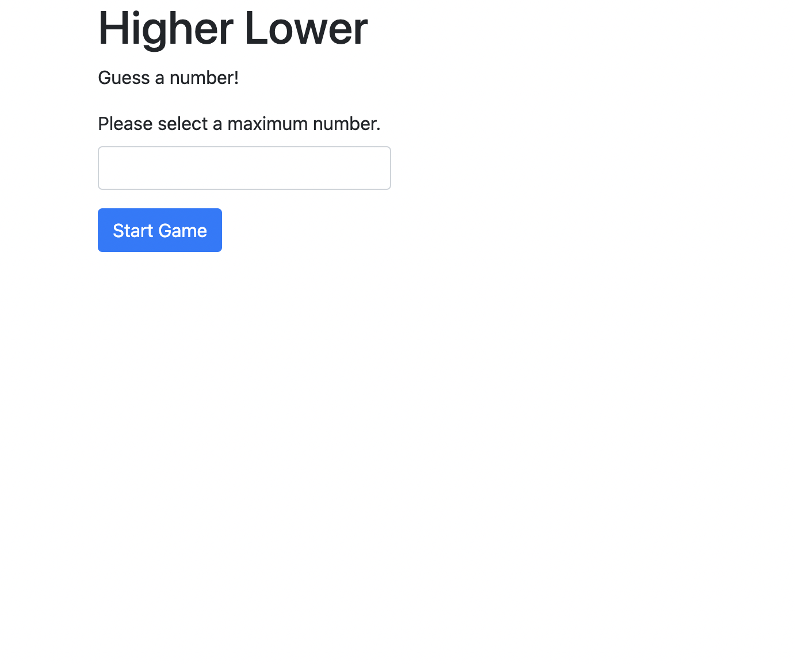
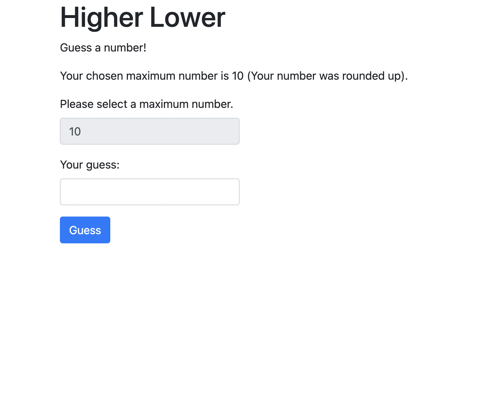
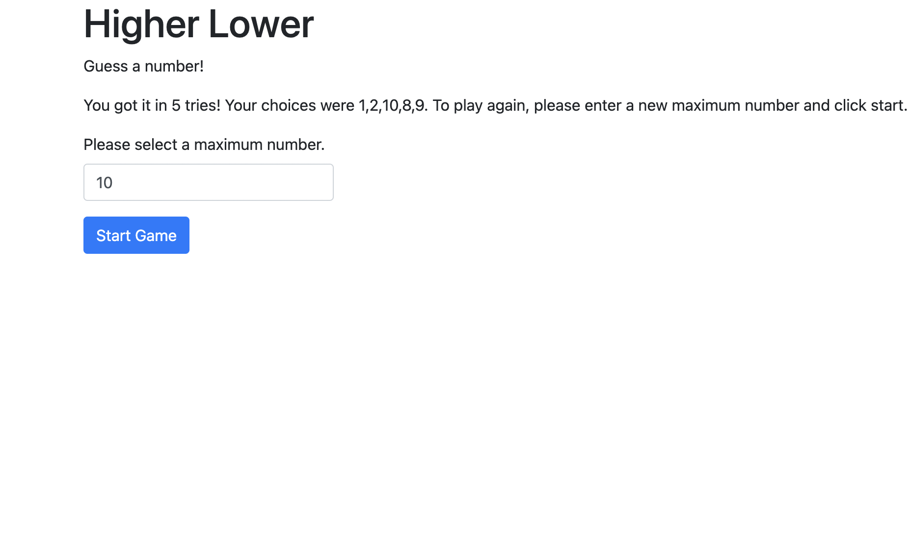

<div align="center" id="readme-top">

  <h3 align="center">Higher or Lower</h3>

  <p align="center">
    A number guessing game!
    <br />
    <br />
    <a href="https://github.com/othneildrew/Best-README-Template">View Demo</a>
</div>


<details>
  <summary>Table of Contents</summary>
  <ol>
    <li>
      <a href="#about-the-project">About The Project</a>
      <ul>
        <li><a href="#built-with">Built With</a></li>
      </ul>
    </li>
    <li><a href="#installation">Installation</a></li>
    <li><a href="#usage">Usage</a></li>
    <li><a href="#license">License</a></li>
    <li><a href="#contact">Contact</a></li>
  </ol>
</details>


<!-- ABOUT THE PROJECT -->
## About The Project



"Higher or Lower" is a fun game where you choose a maximum number and guess between 1 and your chosen number! You must choose a number larger than zero, and you must input a number. This game will keep track of your guesses.

<p align="right">(<a href="#readme-top">back to top</a>)</p>


### Built With

This application is built in vanilla JavaScript. Higher or Lower also utilizes Bootstrap and Jquery!

* [![Bootstrap][Bootstrap.com]][Bootstrap-url]
* [![JQuery][JQuery.com]][JQuery-url]

<p align="right">(<a href="#readme-top">back to top</a>)</p>


### Installation

You can access the application using the demo link. If you decide to clone the application locally, follow the steps below.

    1. Clone the repo using "git clone git@github.com:JunoNguyen/higherLower.git"
   ``` 
    2. Install the "Open in Browser" Visual Studio Code extension.
   ```
    3. Enter a maximum number and have fun!

<p align="right">(<a href="#readme-top">back to top</a>)</p>


## Usage

This application is simply a fun guessing game where you input a maximum number. You are given an unlimited amount of guesses. You must guess numbers, and you cannot repeat guesses!






<p align="right">(<a href="#readme-top">back to top</a>)</p>

## License

Distributed under the MIT License. See `LICENSE.txt` for more information.

<p align="right">(<a href="#readme-top">back to top</a>)</p>


## Contact

Juno Nguyen - [LinkedIn](https://www.linkedin.com/in/juno-nguyen-16198a226/) - junonguyen27@gmail.com

Project Link: [GitHub Repository](https://github.com/JunoNguyen/higherLower)

<p align="right">(<a href="#readme-top">back to top</a>)</p>

[Bootstrap.com]: https://img.shields.io/badge/Bootstrap-563D7C?style=for-the-badge&logo=bootstrap&logoColor=white
[Bootstrap-url]: https://getbootstrap.com
[JQuery.com]: https://img.shields.io/badge/jQuery-0769AD?style=for-the-badge&logo=jquery&logoColor=white
[JQuery-url]: https://jquery.com 